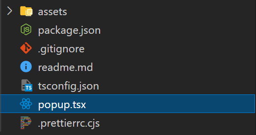
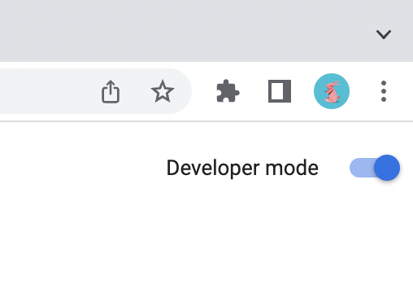
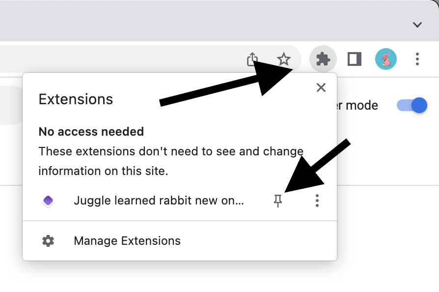

# Plasmo


[Plasmo](https://docs.plasmo.com/framework) 是一个专门开发浏览器扩展程序的框架，使用它来构建您的产品，不用担心配置文件和构建浏览器扩展的奇怪特性

> 就像是浏览器插件开发领域的 Next.js

## 特征

+ 支持 Recat + Typescript 
+ 声明式开发 ， 自动生成 `mainfest.json`（MV3，Manifest Version 3）
+ 热加载
+ `.env*` 文件
+ 远程代码打包（例如用于 gtag4）
+ 自动化部署（通过BPP） 

## 系统要求

+ Node.js 16.x 或更高版本
+ MacOS、Windows 或 Linux
+ 强烈推荐使用pnpm

## 基本使用

​	使用下面命令初始化项目

```
pnpm dlx plasmo init
# OR npm v7
npm x plasmo init
```

​	

此命令将会创建一个最简单的 Plasmo 浏览器插件项目，结构如下:

| 文件名            | 描述                                                         |
| :---------------- | ------------------------------------------------------------ |
| `popup.tsx`       | 该文件导出默认的 React 组件，该组件会渲染到您弹出的页面中。*这就是您在扩展弹出窗口上工作所需的全部内容* |
| `assets`          | Plasmo 会自动生成一些小图标并将它们从'icon512.png' 文件配置到manifest |
| `package.json`    | 常用的 Node.js 项目描述符                                    |
| `.prettierrc.cjs` | 配置代码格式化                                               |
| `.gitignore`      | git 忽略文件                                                 |
| `readme.md`       | READEME 文件                                                 |
| `tsconfig.json`   | TypeScript 配置文件                                          |


要跳过命名提示，可以提供名称作为位置参数：

```
pnpm dlx plasmo init example-dir
# OR npm v7
npm x plasmo init example-dir
```

+ 弹出修改进入 `popup.tsx`
+ 选项页面修改进入`options.tsx`
+ 内容脚本修改进入`content.ts`
+ 后台服务修改进入`background.ts`

### 目录

​	您还可以在它们自己的目录中组织这些文件

```
example-dir
├───assets
|   └───icon512.png
├───popup
|   ├───index.tsx
|   └───button.tsx
├───options
|   ├───index.tsx
|   ├───utils.ts
|   └───input.tsx
├───contents
|   ├───site-one.ts
|   ├───site-two.ts
|   └───site-three.ts
...
```

​	最后，您还可以将源代码放在`src`子目录下，而不是将源代码放在根目录中。请注意，`asset`和其他配置文件仍需要在根目录中

#### 在源代码中使用`src`目录

要使 TypeScript 正常工作，您需要在`tsconfig.json`文件`paths`中将`~*`前缀指向`"./src/*"`

新配置如下所示：

```
{
  "extends": "plasmo/templates/tsconfig.base",
  "exclude": ["node_modules"],
  "include": [".plasmo/**/*", "./**/*.ts", "./**/*.tsx"],
  "compilerOptions": {
    "paths": {
      "~*": ["./src/*"]
    },
    "baseUrl": "."
  }
}
```

​	请确保**所有源文件**（包括 Plasmo 的入口文件，如`popup.tsx`、`options.tsx`、`background.ts`等）都在`src`目录中。否则 Plasmo 将不知道在哪里可以找到入口文件，这将导致一个空的扩展程序

### 构建

您可以使用下面的命令，来构建一个支持热加载的开发环境版本：

```
pnpm dev
```

这将会在`build/chrom-mv3-dev` 中创建扩展程序的开发包。


如果要构建生产环境版本，请使用下面的命令：

```
pnpm build
```

这将会在`build/chrom-mv3-prod`中创建扩展程序的生产包


此外还可以选择为构建命令提供--zip 标志，用来创建上传到 Chrome 商店的的 zip 包

```
pnpm build -- --zip
# OR
npm build -- --zip
# OR
plasmo build --zip
```


### 在 Chrome 中加载扩展程序

1. 前往`chrome://extensions` 并启用开发者模式



2. 单击 Load Unpacked（加载已解压的扩展程序） 并导航到扩展程序的 `build/chrome-mv3-dev`（或 `build/chrome-mv3-prod`）目录加载您的插件

3. 查看您的弹出窗口，请单击 Chrome 工具栏上的 pin 图标，然后单击您的扩展程序，将扩展程序固定到 Chrome 工具栏以便于访问

   

   

## 工作流程

### 开发周期

#### 创建一个扩展程序

> 注意：如果您想将`src`目录用于源代码（`tsx`和`ts`），请务必遵守上述`tsconfig.json`配置

要运行交互式初始化向导，请使用以下命令：

```
pnpm dlx plasmo init
# OR npm v7
npm x plasmo init
```

要跳过命名提示，可以提供名称作为位置参数：

```
pnpm dlx plasmo init "My Awesome Extension"
# OR npm v7
npm x plasmo init "My Awesome Extension"
```

> **注意：**您可以使用 `pnpm i -g plasmo` 将 plasmo CLI 作为全局命令安装 

#### 运行开发环境服务

当您创建了您的项目，您可以通过导航到您项目的目录，运行以下命令后，开始开发您的扩展程序：

```
pnpm dev
# OR
npm run dev
# OR
plasmo dev
```

这将会为您的扩展程序创建一个开发包和一个可以热加载的开发环境，在文件更改的时候自动更新您的扩展包，并在源代码更改时重新加载您的浏览器

#### 加载扩展程序

前往 `Chrome://extensions` 并启用开发人员模式


单击 Load Unpacked（加载已解压的扩展程序） 并导航到扩展程序的 `build/chrome-mv3-dev`（或 `build/chrome-mv3-prod`）目录加载您的插件

查看您的弹出窗口，请单击 Chrome 工具栏上的 拼图图标，然后单击您的扩展程序

**专业提示：**您可通过单击 pin 按钮，将扩展程序固定到 Chrome 工具栏以便于访问




#### 创建生产包

要创建用于分发的生产包，请运行：

```
pnpm build
# OR
npm run build
# OR
plasmo build
```

您可以选择为构建命令提供--zip 标志，用来创建上传到 Chrome 商店的的 zip 包

```
pnpm build -- --zip
# OR
npm build -- --zip
# OR
plasmo build --zip
```

> **注意：**由于 Plasmo 的默认 Typescript 配置将左右源文件视为模块，若果您的代码没有任何导入导出，则必须在文件开头添加一行  `export {}` (您将会在创建第一个脚本内容时看到此警告)

#### 添加弹出页面

创建一个 `popup.tsx` 或 `popup/index.tsx` 文件来导出默认的 React 组件。这样您的弹出窗口就可以使用了

有关示例，请参见 [with-popup](https://github.com/PlasmoHQ/examples/tree/main/with-popup)

#### 添加选项 UI

创建一个`options.tsx` 或`options/index.tsx`文件来渲染 options_ui 

有关示例，请参见 [with-options](https://github.com/PlasmoHQ/examples/tree/main/with-options-ui)

#### 添加新标签页

创建一个`newtab.tsx`或`newtab/index.tsx`文件，Plasmo 将负责渲染您的新标签页 

有关示例，请参见 [with-newtab](https://github.com/PlasmoHQ/examples/tree/main/with-newtab)

#### 添加后台服务

在根目录创建一个 `background.ts` 文件

有关示例，请参见 [with-background](https://github.com/PlasmoHQ/examples/tree/main/with-background)

### 内容脚本

内容脚本在网页上下文中运行。有以下最常见的用例：

+ 从当前网页抓取数据
+ 从当前网页选择、查找、样式化元素
+ 将 UI 元素注入到当前网页

#### 添加单个内容脚本

创建一个`content.ts` 来导出空对象的文件（或导入一些库）

有关示例，请参见 [with-content-script](https://github.com/PlasmoHQ/examples/tree/main/with-content-script)

#### 添加多个内容脚本

为多个内容脚本创建一个 `contents`文件夹，并将您的内容脚本添加在其中

有关示例，请参见[with-many-content-scripts](https://github.com/PlasmoHQ/examples/tree/main/with-many-content-scripts) 

#### 自定义内容脚本配置

要提供自定义内容脚本配置（例如匹配每个脚本的自定义域、全部帧等），青葱脚本内容导出配置对象，如下所示：

```js
import type { PlasmoContentScript } from "plasmo"

export const config: PlasmoContentScript = {
  matches: ["<all_urls>"],
  all_frames: true
}
```

#### 注入 main world

如果您想从内容脚本访问 `window` 对象，则必须注入 main world

目前，无法通过 manifest 的 `content_scripts`字段以声明方式将内容脚本注入 main world

相反，Chrome 提供了一个 `chrome.scripting.executeScript` API，允许您将内容脚本注入 main world

```js
chrome.scripting.executeScript(
    {
      target: {
        tabId // the tab you want to inject into
      },
      world: "MAIN", // MAIN to access the window object
      func: windowChanger // function to inject
    },
    () => {
      console.log("Background script got callback after injection")
    }
  )
}
```

对于`func` 的值，您可以从项目中传入一个 Typescript 函数，该函数会在您的扩展程序打包时自动转换为 JavaScript 函数

有关示例，请参见[with-main-world-content-script-injection](https://github.com/PlasmoHQ/examples/tree/main/with-main-world-content-script-injection)

#### 注入 UI 元素

Plasmo 支持通过脚本内容将 React 组件挂载到当前网页中

1. 重命名现有内容脚本或使用 `tsx` 扩展名创建一个新的内容脚本
2. 导出默认的 React 组件
3. 完成

有关示例，请参见[with-content-scripts-ui](https://github.com/PlasmoHQ/examples/tree/main/with-content-scripts-ui)

**Plasmo 如何挂载 React 组件**

plasmo 创建一个 Shadow Dom 来挂在组件。这种隔离技术可以防止网页样式影响您的组件样式

#### 获取挂载节点

在某些情况下，您可能希望您的 React 组件挂载或锚定在当前网页的特定元素智商。为此，导出一个返回有效的 `HTMLElement` 的`getMountPoint` 方法

```js
export const getMountPoint = async () => document.querySelector("#element")
```

这个函数可以是异步的，允许你等到元素存在。它也是非常不可知的。例如，你可以通过 fetch 将当前网页发送到远程 API 来计算元素选择器，查询并返回该元素

有关示例，请参见[with-content-scripts-ui](https://github.com/PlasmoHQ/examples/blob/main/with-content-scripts-ui/contents/plasmo-mount.tsx)

**getMountPoint 如何锚定我的组件**

它首先监听当前窗口的滚动时间。在每个滚动事件上，它使用 `getBoundingClientRect` 方法计算目标元素的绝对定位。然后，它将位置应用于您组件挂载的容器

#### 获取样式

要将样式表逐日内容脚本 UI 的 Shadow DOM（或当前网页的任何位置），你可以导出一个返回有效`HTMLElement.style`元素的`getStyle` 方法

```javascript
import cssText from "data-text:~/contents/plasmo-overlay.css"

export const getStyle = () => {
  const style = document.createElement("style")
  style.textContent = cssText
  return style
}
```

Plasmo 将会在导出组件容器之前将样式元素加至 Shadow DOM 中

有关示例，请参见[with-content-scripts-ui 中的 plasmo-overlay.tsx 文件](https://github.com/PlasmoHQ/examples/blob/main/with-content-scripts-ui/contents/plasmo-overlay.tsx)

**关于 `data-text`方案的注意事项**

在上面示例汇总，我们使用 `data-text` 方案将样式表作为纯文本加载到 cssText 变量中，然后我们将其分配给样式元素的文本内容中。如果您使用 `src` 目录，在使用次方案时注意导入路径，如[此处](#`data-base64`和`data-text`方案)描述

#### 获取根容器

要替换提供的 Shadow DOM，您可以导出一个返回有效的`HTMLElement`的`getRootContainer` 方法

用例：

+ 扩展程序需要继承托管网页的样式
+ 扩展程序需要将组件直接挂载到网页中，而不是覆盖 Shadow DOM

```javascript
export const getRootContainer = () => {
  return document.querySelector("#feature")
}
```

> 如果您导出`getRootContainer` 方法，Plasmo 会忽略 `getStyle` 方法，因为只有提供 Shadow DOM 的容器使用它。`getMountPoint`的行为也有可能会被影响（因为组件的位置将相对于您提供的容器）

有关示例，请参见[with-content-scripts-ui](https://github.com/PlasmoHQ/examples/blob/main/with-content-scripts-ui/contents/plasmo-root-container.tsx)

### 资源

Plasmo 处理`assets`目录中的一些文件。建议使用此功能来存储您可能希望内联加载到源代码中的任何资源（而不是将它们复制到构建的包中）

#### 扩展程序图标 `assets/icon512.png`

框架使用`assets/icon512.png`文件作为扩展程序图标。它会自动为最终构建包生成更小分辨率版本的图标。因此，您需要处理的只是 512x512 版本

#### 内联导入图像资源

在扩展程序中加载图像的最简单方法是使用该`data-base64`方案。这会将图像转为 base64 编码数据内联到扩展程序的构建包中

```js
import someCoolImage from "data-base64:~assets/some-cool-image.png"

...


```

#### `data-base64`和`data-text`方案

`data-base64`和`data-text`方案的波浪号 ( `~`)**始终**解析为根目录。这一点在您使用的是[`src`设置目录](#在源代码中使用`src`目录) 时尤其重要。通过`src`设置，`~`有两个含义：

+ 如果它是单独存在的，例如`~core/code-module` ，Plasmo 将其解析为 `/src/core/core-module.ts`(或tsx)
+ 如果与上述两种方案一起使用，`~`则解析为项目根目录。因此，`data-base64:~assets/image.png`解析为`/assets/image.png`

### 环境变量

Plasmo 框架与 Next.js 类似使用[`dotenv`package](https://www.npmjs.com/package/dotenv)的 .env 文件级联/覆盖策略。要添加可访问扩展程序的公共环境变量，请创建如下`.env`文件：

```
PLASMO_PUBLIC_SHIP_NAME=ncc-1701
PLASMO_PUBLIC_SHIELD_FREQUENCY=42

PRIVATE_KEY=xxx
```

只有带`PLASMO_PUBLIC_` 前缀的环境变量才会在您的扩展程序的构建版本中暴露，然后，您才可以在任何您的扩展程序的源文件中使用他们：

```js
// For TSX (popups, options):
const FrontHull = () => <h1>{process.env.PLASMO_PUBLIC_SHIP_NAME}</h1>

// For TS (content scripts or background-scripts):
const shield = new Shield(process.env.PLASMO_PUBLIC_SHIELD_FREQUENCY)

// Will throw error/be undefined
console.log(process.env.PRIVATE_KEY)
```

若要覆盖使用 `plasmo build` 构建的生产包中的变量，您可以提供一个 `.env.production` 文件。由于 Plasmo 会“级联”这些 env 文件，因此您只需指定要替换的变量

您可能还会喜欢带有环境变量的 Typescript IntelliSence，请使用以下声明创建一个 `index.d.ts` 文件

```js
declare namespace NodeJS {
  interface ProcessEnv {
    PLASMO_PUBLIC_SHIP_NAME?: string
    PLASMO_PUBLIC_SHIELD_FREQUENCY?: number
  }
}
```

#### 非级联环境变量

当希望某些环境变量严格用于开发，而不是级联到它们的生产构建。可以使用以下特定于环境的文件

+ `.env.development`
+ `.env.production`

如果有一个 `CRX_PUBLIC_KEY` 变量在 `.env.development`，但不在 `.env.production` 或 `.env`，那么它只会在 `plasmo dev` 时可用， `plasmo build` 时不可用

#### 本地命名空间环境变量

Plasmo 还支持一下环境文件：

+ `.env.local`
+ `.env.production.local`
+ `.env.development.local`

请注意，这些文件的优先级高于非本地文件。因此，`.env.local`有比`.env.production`和`.env.development`更高的优先级 。然而，在同一个命名空间中，级联顺序是符合预期的。

#### 在远程代码导入语句中使用 env

```js
import "https://www.plasmo.com/js?id=$PLASMO_PUBLIC_ITERO"
```

#### 在 manifest 覆盖中使用 env

Plasmo 使您能够通过[package.json 文件](https://docs.plasmo.com/customization#overriding-the-manifest)[的 manifest 属性覆盖最终生成的扩展程序的`manifest`](https://docs.plasmo.com/customization#overriding-the-manifest)。更强大的是，Plasmo 还可以解析任何在 manifest 覆盖中使用的环境变量：

```json
"manifest": {
  "key": "$CRX_PUBLIC_KEY"
}
```

您可以同时使用公共（以 `PLASMO_PUBLIC` 为前缀）和私有环境变量

> 注意： 如果 Plasmo  找不到环境变量，它将删除密钥


### 远程代码

Plasmo 在构建时使用 `https` 协议自动绑定所有指向远程资源的导入语句。

将[Google Analytics 4](https://developers.google.com/analytics/devguides/collection/ga4) 跟踪代码添加到我们的弹出窗口如下：

```js
import "https://www.googletagmanager.com/gtag/js?id=XXXXXX"
```

由于 Plasmo 会解析 import  语句，我们可以在 import 中使用环境变量。在 `.env.local` 文件中定义跟踪 ID

```
PLASMO_PUBLIC_GTAG_ID=XXXXXX
```

然后，您可以通过在其名称前添加前缀  `$` 在您的导入中使用它：

```js
import "https://www.googletagmanager.com/gtag/js?id=$PLASMO_PUBLIC_GTAG_ID"
```


### 国际化

Plasmo 内置了对国际化（i18n）的支持。

Plasmo 期望您的 i18n 字符串在 `assets/_locales/{lang}/messages.json` 文件中

```json
{
  "extensionName": {
    "message": "with-18n",
    "description": "Name of the extension."
  },
  "extensionDescription": {
    "message": "Example using i18n!",
    "description": "Description of the extension."
  },
  "popup": {
    "message": "This is showing the power of i18n!",
    "description": "Popup message."
  }
}
```

在 manifest 指定 default_locale，如下：

```json
"manifest": {
    "host_permissions": [
      "https://*/*"
    ],
    "default_locale": "en"
  }
}
```

现在你就可以使用 Chrome 提供的所有 i18n 功能

例如，我们可以这样获取 i18n 字符串

```js
import { useState } from "react"

function IndexPopup() {
  const [data, setData] = useState("")

  return (
    <div
      style={{
        display: "flex",
        flexDirection: "column",
        padding: 16
      }}>
      <h1>
        Welcome to your <a href="https://www.plasmo.com">Plasmo</a> Extension!
      </h1>
      <h2>{chrome.i18n.getMessage("popup")}</h2>
      <input onChange={(e) => setData(e.target.value)} value={data} />
    </div>
  )
}

export default IndexPopup
```

在 package.json 中，获取 i18n 字符串看起来像：

```json
{
  "name": "__MSG_extensionName__",
  "displayName": "__MSG_extensionName__",
  "version": "0.0.0",
  "description": "__MSG_extensionDescription__",
  "author": "coldsauce",
  "scripts": {
    "dev": "plasmo dev",
    "build": "plasmo build"
  },

```


### 自动提交

Plasmo 框架附带一个方便的 GitHub 操作，称为[Browser Platform Publish](http://bpp.browser.market/)或 BPP。此操作将自动将您的扩展程序发布到所有受支持的浏览器扩展市场。它默认在手动触发器上运行，但更改其配置可以使其在每次推送时运行。

在开始发布您的扩展程序前，请先设置`keys.json` 文件

```json
{
  "$schema": "https://raw.githubusercontent.com/PlasmoHQ/bpp/v2/keys.schema.json"
}
```


