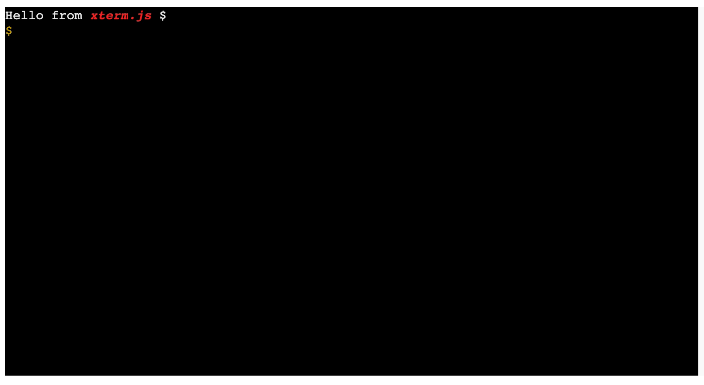

# Xterm.js

Xterm.js 是一个使用 TypeScript 编写的前端终端组件，它允许应用程序在浏览器中为用户提供功能齐全的终端。它被VS Code，Hyper、Theia等热门项目所使用。

## 特征

+ **终端应用正常工作：**  Xterm.js 适用于大多数终端应用程序，如 `bash`，`vim` 和 `tmux`，包括对基于 curse的应用程序和鼠标事件的支持。

+  **性能：** Xterm.js 非常快，它甚至包括一个 GPU 加速渲染器。

+ **丰富的 Unicode 支持：**支持 CJK、emoji 和 IME。

+ **自包含：**需要零依赖才能工作。

+ **可访问：**可以打开屏幕阅读器和最小对比度支持

+ **还有更多：** 链接、主题、插件、文档齐全的API等

  

## Xterm.js 不是什么

+ Xterm.js 不是你可以在计算机上下载和使用的终端应用程序
+ Xterm.js 不是`bash`。Xtrem.js 可以像`bash`一样连接到进程让您与它们进行交互（提供输入、接收输出）。


## 入门

首先，您需安装安装模块，Xtrem.js 仅通过 npm 发布，因此您需要安装该模块，然后通过运行添加 xterm.js 作为依赖项：

```
npm install xterm
```

要开始在浏览器上使用 xterm.js，请将 `xterm.js` 和 `xterm.css` 添加到 HTML 页面头部。然后创建一个`<div id="terminal"></div>` 让 xterm 可以自行附加的 `div`。最后，实例化该 `Terminal` 对象，然后在这个 `div` 的 DOM 节点调用 `open` 方法

```html
<!doctype html>
  <html>
    <head>
      <link rel="stylesheet" href="node_modules/xterm/css/xterm.css" />
      <script src="node_modules/xterm/lib/xterm.js"></script>
    </head>
    <body>
      <div id="terminal"></div>
      <script>
        var term = new Terminal();
        term.open(document.getElementById('terminal'));
        term.write('Hello from \x1B[1;3;31mxterm.js\x1B[0m $ ')
      </script>
    </body>
  </html>
```

运行效果图如下所示：



### 导入

推荐通过 ES6 模块语法加载使用 xterm.js：

```js
import { Terminal } from 'xterm';
```

### 插件

*本节介绍v3.14.0 中引入的新插件格式，有关旧格式的说明[请参见](https://github.com/xtermjs/xterm.js/blob/3.14.2/README.md#addons)*

插件是通过构建 xrerm.js API 上扩展的独立模块。要使用插件，您首先需要在项目中安装它：

```
npm i -S xterm-addon-web-links
```

然后导入插件，实例化它并调用 `Terminal.loadAddon`：

```js
import { Terminal } from 'xterm';
import { WebLinksAddon } from 'xterm-addon-web-links';

const terminal = new Terminal();
// Load WebLinksAddon on terminal, this is all that's needed to get web links
// working in the terminal.
terminal.loadAddon(new WebLinksAddon());
```

Xterm.js 团队维护以下插件，但任何人都可以构建他们：

+ [`xterm-addon-attach`](https://github.com/xtermjs/xterm.js/tree/master/addons/xterm-addon-attach) ：通过 websocket 附加到运行进程的服务器
+ [`xterm-addon-fit`](https://github.com/xtermjs/xterm.js/tree/master/addons/xterm-addon-fit) ：使终端适合于包含元素
+ [`xterm-addon-search`](https://github.com/xtermjs/xterm.js/tree/master/addons/xterm-addon-search) ：添加搜索功能
+ [`xterm-addon-web-links`](https://github.com/xtermjs/xterm.js/tree/master/addons/xterm-addon-web-links) ：添加网页跳转功能


## 浏览器支持

由于 xterm.js 通常是作为开发工具，因此官方只支持现代浏览器。尤其是最新版本的 Chrome、Edge、Friefox、Safari。

还支持部分 Internet Explorer 11，这意味着 xterm.js 应该可以在大多数情况下工作，但保留不提供部专门针对它的解决方法的权利，除非绝对有必要让基本的输入/输出流程正常工作

Xterm.js 可以在 Electron 应用程序中无缝运行，甚至可以在早期版本的浏览器上运行。这些版本是 xterm.js 力争保持运作的

### Node.js支持

Xterm.js 还发布了 [`xterm-headless`](https://www.npmjs.com/package/xterm-headless) ，一个在 Node.js 中运行的 xterm.js 精简版本。一个使用示例，跟踪进程运行并使用序列化插件时的终端状态，以便在重新连接时恢复所有状态


## API

Xterm.js 的完整 API 包含在[TypeScript 声明文件中](https://github.com/xtermjs/xterm.js/blob/master/typings/xterm.d.ts)，使用 GitHub（`w`） 中的分支/标签选择器导航到 API 的正确版本。

请注意，一些 API 被标记为*实验性*的，添加这些 API 是为了对新想法进行实验，无需像普通的[语义化](https://semver.org/) API 那样承诺支持它。请注意这些 API 在版本之间可能会发生根本性的变化，因此如果您计划使用实验性 API，请务必阅读发行说明


## 实际用途

Xterm.js 被广泛应用于多个世界级的应用程序中，并为其提供了出色的终端体验，如：

+ [**SourceLair**](https://www.sourcelair.com/)
+ [**Microsoft Visual Studio Code**](http://code.visualstudio.com/)
+ [**ttyd**](https://github.com/tsl0922/ttyd)
+ [**Katacoda**](https://www.katacoda.com/)
+ [**Eclipse Che**](http://www.eclipse.org/che)
+ [**WebSSH2**](https://github.com/billchurch/WebSSH2)
+ [**Codenvy**](http://www.codenvy.com/)
+ [**CoderPad**](https://coderpad.io/)
+ [**Terminal for Atom**](https://github.com/jsmecham/atom-terminal-tab)
+ [**Spyder Terminal**](https://github.com/spyder-ide/spyder-terminal)
+ 以及更多，[详见](https://github.com/xtermjs/xterm.js)


## 发布

Xterm.js 大致遵循发布周期为每月

所有当前和过去的版本都可以在 [发版日志](https://github.com/xtermjs/xterm.js/releases)中找到，您可以在 [wiki](https://github.com/xtermjs/xterm.js/wiki/Roadmap) 上查看高优先级路线图，通过 [Milestones](https://github.com/sourcelair/xterm.js/milestones) 了解 xterm.js 现在在做什么

### 测试版

通过 npm 安装最新的 beta 版本

```
npm install -S xterm@beta
```

这些版本通常是稳定的，但可能会出现一些错误。我们建议主要使用 beta 版来测试新功能并验证错误修复


## 贡献

您可以阅读 [wiki](https://github.com/xtermjs/xterm.js/wiki/Contributing) 上的指南，了解如何贡献和设置 xterm.js 以进行开发


## 许可协议

如果您为这个项目贡献代码，您就隐式允许您的代码在 MIT 许可下分发。您同时隐式声明您的所有代码都是原创

版权所有 (c) 2017-2019, [The xterm.js authors](https://github.com/xtermjs/xterm.js/graphs/contributors) (MIT License)
版权所有 (c) 2014-2017, SourceLair, Private Company ([www.sourcelair.com](https://www.sourcelair.com/home)) (MIT License)
版权所有 (c) 2012-2013, Christopher Jeffrey (MIT License)


