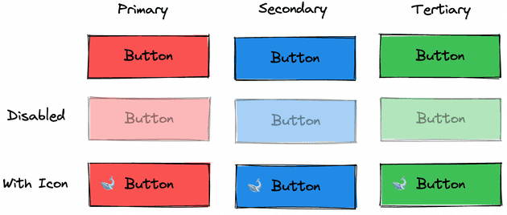
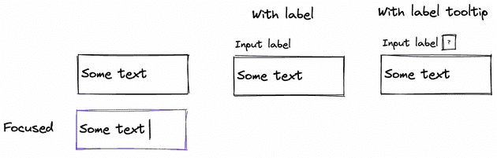
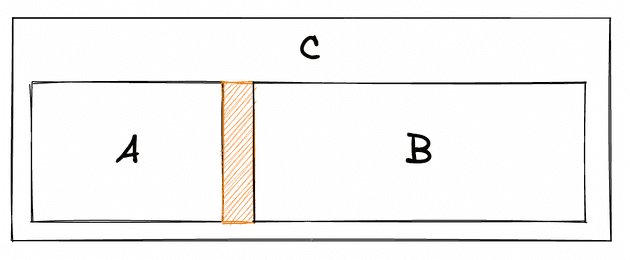
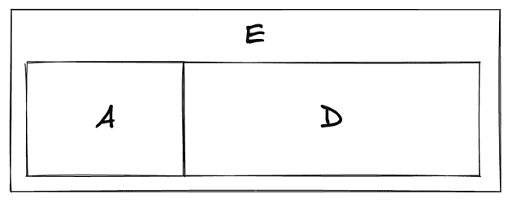
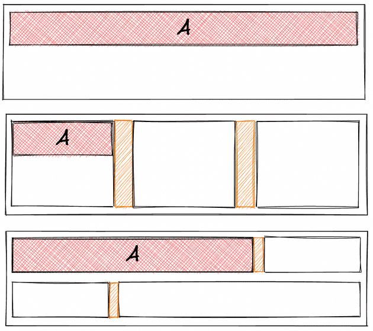

# 维护 React 内部组件库注意事项

发表于 2022年6月16日

自2021年11月起，我一直在 [DigitalOcean](https://www.digitalocean.com/)  的 UI 基础架构团队工作。我的主要职责之一是担任 React 内部组件库 Walrus 的主要维护者。这个库比我加入的时间要早几年，看到以前的设计选择是如何发挥作用的是一件很有趣的事情。

本文档是我维护组件库的想法的整合，该组件库是被大量前端应用程序使用的——React，现有设计体系的一部分。我并不是特别关心视觉设计，尽管我在实现视觉设计方面颇有建树，反而我对构建大型组件库的软件工程和社会化挑战更感兴趣。

当我有进一步见解时，我可能会更新这篇文章。

## 思想体系

维护组件库时，我试图了解通过接口提供的微妙激励。如果开发人员可以操纵手柄，它最终都会被拉动 。有时开发者是团队中最资深的人，有时开发者是新人。有数十万行代码，要完成的任务，以及知道正确的事情需要太多的上下文。这个问题源于大型团队，并且存在于每个团体中。如果手柄存在，它就会被拉动。

但是责任并不完全落在看到手柄的开发人员身上，重担也必须落在提供它的开发者身上。好的设计是让仓库使用者[成功的关键](https://blog.codinghorror.com/falling-into-the-pit-of-success/)。为实现此结果，做计划时需要耐心思考，不能着急。 可以说，本文的全部内容归结于我最大化以下内容：

1. **将设计转为 UI 代码应该很容易**。属性应该直观地映射到 Figma 或其他设计协作工具中。在不应用覆盖的情况下，组件应该看起来正确。
2. **在绝大多数情况下，****组件对于他的父级是一个黑盒****。**它不应泄漏其相关的内部细节或允许注入任意代码/样式。数据进入；html标签出来了。
3. **显而易见的事情、简单的事情和正确的事情应该在大部分时间重叠。**在时间紧迫的压力下，开发人员通常会寻求最简单的解决方案，理想情况下，最简单的解决方案也是最易理解的。而我[希望易理解性是开发者最优先做的事情](https://www.youtube.com/watch?v=SxdOUGdseq4)
4. **做错事至少应该是不舒服的，最坏情况是****不可能的**。必要时允许应急方法但要让开发人员感觉不舒服。开发人员应该想，“我应该去提个issue，而不是再一次干这事” 
也就是说，本文档中的任何规则都不是一成不变的。他们有他们的权衡，通常归结为我更喜欢*设计系统的一致性*而不是风格的灵活性。继续阅读时请记住这一点。

最后，因为动机不同，我认为这里所采取的措施不一定适用（但也许他们适用？）通用的开源组件库。组件库应该足够灵活，不同的两家公司使用可以有不同的呈现效果。例如，Walrus 只需要看起来像我公司，而开源的组件库不需要看起来像我公司

## 人人所有就无人所有

我强烈认为，必须有人拥有组件组。如果没有所有者，组件库将累积大量的一次性的，如“我就是要这个功能”类型的更改，这些更改在分组时不会反映设计系统的整体视图。因此至少有一名开发人员的工作描述必须是组件库的维护。

例如，假设产品工程师收到了一些他们必须实施的新设计。它可能包含，在设计系统中*但尚未在组件库中实现的组件*的变体。这种不完整性是一个大问题，因为产品工程师必须对他们不负责维护的组件库做一些事情。如果没有专门的所有者，实施的解决方案通常是最简单方法（通常是错误的解决方法）：

1. **更新组件足以获得所需的结果，仅此而已。**将来会减慢开发人员的速度，因为他们必须经常检查组件内部以了解界面中存在的各种一次性属性。
2. **不要更新组件并用**`styled-components`**或以其他方式包装它。**创建碎片，因为这些更改很少将其返回到组件库中。
3. **不受控，从头开始实施其他东西。**通常不考虑解决库中可能已经存在的的边缘情况。
 这些类型的解决方案往往会复合。对组件的更改现在需要额外的努力，因为覆盖可能造成视觉位置的变化，因此不动它更容易。而且要一直这样做。随着越来越多的覆盖被应用，样式上的改变会变的越来越有风险。如果您现在正在使用无人维护的组件库工作，我相信您会感到这种痛苦。

长话短说，如果组件库的糟糕不会影响到某个人的考核，它就一定会很糟糕。

## 组件接口简明的表达出设计上的变化会更加易于使用

在浏览设计文档时，我试着查看是否可以“可视化”所有变化，就好像它们是 N 维空间中的轴一样，其中每个维度都与单个属性相关联。



必须了解视觉差异哪些是独立运作，哪些是不独立运作的。例如，`Button` 的 `type` 和 `disabled` 属性是相互独立（正交？）的。设计师（希望）永远不会建议“不能禁用辅助（secondary）按钮”

```plain
type Props = {
  type?: 'primary' | 'secondary' | 'tertiary';
  disabled?: boolean;
  icon?: Icon;

  /* ... */
}

export Button: React.FC<Props> = (props) => {
 /* ... */
};
```
相反，相互依赖的差异应该合并到一个单一的属性中，并且这个单一属性运作应该呀。例如，`TextInput` 的可选标签，这些个标签也可选择提供提示。


在 `TextInput` 中同时有 `label` 和 `labelTooltip` 两种属性是没有意义的，因为没有 label 标签就不会显示提示框。它们应该合并到一个属性中来满足这个要求：

```plain
// ❌ Does not indicate that `labelTooltip` depends on `label`!
type Props = {
  label?: string;
  labelTooltip?: string;

  /* ... */
}

// ✅ `tooltip` cannot exist without `text`!
type Props = {
  label?: string | { text: string; tooltip?: string };
}

export TextInput: React.FC<Props> = (props) => {
  const label = props.label ? normalizeLabel(props.label) : null;

 /* ... */
};
```
这个类型让我想起我一直以来最喜欢的变成原则之一[“](https://www.youtube.com/watch?v=DM2hEBwEWPc)使[非法状态无法表示”](https://www.youtube.com/watch?v=DM2hEBwEWPc)。我们假设设计系统代表了所有可能的“合法视觉状态”，那么属性不应该允许存在非法视觉~~状体~~。
有人可能会反驳说“好吧，如果label不存在，那么组件将不会显示tooltip，并且展示依然有效。”此外，有人会添加一个检查执行常量的运行环境。

但是为什么要等到运行时呢？为什么要等到让其他开发者感到困惑呢？这种懒惰将正确性的责任推给了开发人员（以及后续的每一位开发人员）。根据类型检查器， `<TextInput labelTooltip="!"/>`  是完全有效的。这段代码中有一个隐式规则，即提示框没有标签就不能存在，由 type 明确声明  `{ text: string; tooltip?: string }`。

在极端情况下，一个组件可能需要一个属性界面来打开单个键，这与 Redux 的 Reudcer 打开 `action.type` 不同。在这种情况下，创建几个不同的组件（可能使用通用的内部基础组件）会更有意义。

## 组件可能不应该定位自己

考虑下图。组件 **C** 中渲染 组件 **A** 和 **B**。 **A** 和 **B** 之间有一个间距。问题来了：由谁来声明这个间距呢？



假设这个间距作为 **A** 的 `margin-right`。也就是说，这个间距是  **A** 内部的。这样做的问题是，默认 **A** 包含一个 `marign-right`。

鉴于此，下图这种情况应该怎么办？。有一个组件 **E** ，在其中渲染 **A** 和 **D** ，两者之间没有间距。



如果 **A** 内部由 `margin-right` ，我们就不得不将其覆盖为 0。它有效地将样式恢复为默认浏览器值。。采取这种方式感觉就像是代码异味。

```plain
const StyledA = style(A)`
  margin-right: 0;
`;
```
避免此问题的一般方法是：组件[不应将边距（即间距）应用于自身外部](https://mxstbr.com/thoughts/margin/)。因此，该问题的正确答案是`C`**始终声明间距**。我还没有找到一个像样的反例来反驳这种说法。
## 组件应该占据所给定的全部水平空间

大多数时候，一个组件应该占据*父级给它的*所有宽度。也就是说，大多数组件的默认状态是占据它们内部的整个宽度。当一个组件没有占据页面的整个宽度时，这*通常是*因为它呈现在一个正在执行约束的容器（flex/grid/space 等）中。



应用这个规则使响应式页面更易于实现，因为几乎所有媒体查询 CSS 都可以存在（它们应该存在的位置）于容器组件内（flex/grid/spacer等）

## 组件不应该暴露 className 或 style 属性

`className` 和 `style` 破坏了组件的*风格封装*。这些属性允许用户随心所欲地应用*任意*风格覆盖。当设计系统规范已经存在于实现中时，这种 hack 可能*不是*您想要的。

在理想情况下，父组件应该将子组件视为一个不透明的盒子，带有*非常特定*的手柄（因为所有手柄迟早都会被拉动）。用户不应该能够（或不需要）“进入”一个组件来从根本上任意地改变组件表现。

## 如果我们必须为自定义样式的覆盖提供方法，最好将他们公开为 UNSAFE_className 和 UNSAFE_style

坚持“永远没有样式覆盖！”是完全不合理的。如果必须要提供一个方案，那么做起来可能会感觉很糟糕并且很容易检索。我从朋友那里偷来的解决方案是在这两个属性前面加上`UNSAFE_`。

```plain
// ❌ Nothing to see here.
const btn1 = <Button className="a b c" />;

// ✅ Feels terrible. Looks gross. Easy to grep.
const btn2 = <Button UNSAFE_className="a b c" />;
```
`className是``styled-components` 这种类型的库用来注入任意样式的钩子 ，使用 `UNSAFE_className` 代替 `className` 规避了 `styled-components`  带来的缺陷。我认为这是一个巨大的胜利。
它还为 linter 规则或其他工具打开了大门，以防止过度使用覆盖。它们是不可能检查出 `className` 的。

## 一般尽量避免从基础元素属性继承

扩展基本类型，例如 `React.HTMLAttributes<HTMLButtonElement>` 将组件的接口扩展数百个键。根据我的发现，如果我们这样做，我们可能会尝试将它们全部转发到您组件（`Button`）的某个基本元素（`button`） 中。例如：

```plain
interface Props extends React.HTMLAttributes<HTMLButtonElement> {
  type?: "primary" | "secondary" | "tertiary";
  disabled?: boolean;
  icon?: Icon;
  /*  */
}

const Button: React.FC<Props> = (props) => {
  const { type, disabled, icon, ...rest } = props;

  /* ... */

  return <button {...rest} />;
};
```
在构建组件接口时，我想非常清晰的知道它允许的变化。出于相同的原因，我不想从基类扩展`className` 或 `style`。*任意*修改的大门打开。
## 避免 JSX 在外部数据上使用展开符，有时可以避免一些奇怪的缺陷

也就是说，我在处理外部数据时避免使用任何扩展运算符。我不希望能够将前置属性从一个组件覆盖到另一个组件。（老实说，我觉得这是一个处理属性的绝妙规则。）在外部数据上使用扩展有一些缺点：

1. **它不明确特定属性的来源。**Grepping  没有起到真正的作用
```plain
   type AProps = {
     thing?: string;
     other?: number;
     disabled?: boolean;
     /* ... */
   };

   const A: React.FC<AProps> = (props) => {
     const [disabled, setDisabled] = React.useState(false);

     /* ... */

     return <B {...props} disabled={props.disabled || disabled} />;
   };

   type BProps = {
     thing?: string;
     other?: number;
     disabled?: boolean;
     /* ... */
   };

   const B: React.FC<CProps> = (props) => {
     const disabled = React.useContext(DisabledContext);

     /**
      * Whether `C` is `disabled` depends on whether
      * `disabled` was passed into `A`.
      */
     return <C disabled={disabled} {...props} />;
   };
```
2. **它使转发意外属性成为可能。** TypeScript 不会捕获到这一点。
```plain
   // button.tsx

   type Props = {
     children: React.ReactNode;
     onClick(): void;
   };

   export const Button = (props: Props) => {
     return <button {...props} />;
   };
   // account.tsx

   import { Button } from "./button";

   const Account = () => {
     // ...

     const buttonProps = {
       onClick() {
         /* ... */
       },
       style: {
         /* Oops... */
       },
     };

     return <Button {...props}>Save</Button>;
   };
```
我建议，尽可能根据需要解构属性对象和转发键。分解属性可以通过删除过多的键，允许设置默认值，并使 grepping 代码更容易。
## 限制子组件的“透传”属性可能会有更好的扩展

假设一个 `Modal` 组件至多有两个按钮，保持模态的通用性并允许使用完整的属性自定义按钮是很诱人的：

```plain
type Props = {
  // ...

  primaryButtonProps?: React.ComponentProps<Button>;
  secondaryButtonProps?: React.ComponentProps<Button>;
};

const Modal: React.FC<Props> = (props) => {
  /* ... */
};
```
我认为这对于应用程序不经常使用的 `Modal` 组件内部的基础级别的属性是很好的。尽管如此，除非每个调用站点都有相同的**primaryButtonProps**  blob。此外，对`Button` 的显式调用会将有关实现细节给父组件——我正在考虑是否禁用`Button`。
相反，Modal 应该描述不同视觉状态的变化。Button 属性（现在称为“Action”属性）通常应该限制在实例之间合理变化的少数事物上。

```plain
type Props = {
  type: "alert" | "info" | "confirm";
  disabled?: boolean;
  primaryActionProps: {
    onClick(): void;
    children: string;
    icon?: Icon;
    /* ... */
  };
  secondaryActionProps?: {
    onClick(): void;
    children: string;
    icon?: Icon;
    /* ... */
  };
};
const Modal: React.FC<Props> = (props) => {
  /* ... */
};
```
在我看来，这是将控制转移到Modal。在未来，我们可能会决定将“info”模式中的辅助操作作为一个链接组件而不是按钮。前一种情况，这是一个相当大的突破。然而，关键是有了这些新界面，这些细节将被降级到Modal。
## 大多数时候，对相互依赖的组件使用 React 上下文是一个好主意

据我了解，上下文的最初预设是为了不必显式地通过组件树逐层传递 props，就可以链接所依赖组件的数据。

例如，让我们构建自定义`SelectMenu`和`SelectOption`组件，如果不使用上下文，我们将不得不把相同的`onSelect`处理程序和`selected`布尔值传递给每个选项：

```plain
import { SelectMenu, SelectOption } from "some-walrus-lib";

const Thing = () => {
  const [selected, setSelected] = React.useState<string>(null);

  return (
    <SelectMenu>
      <SelectOption
        value="a"
        onSelect={setSelected}
        selected={selected === "a"}
      >
        Option A
      </SelectOption>
      <SelectOption
        value="b"
        onSelect={setSelected}
        selected={selected === "b"}
      >
        Option B
      </SelectOption>
      <SelectOption
        value="c"
        onSelect={setSelected}
        selected={selected === "c"}
      >
        Option C
      </SelectOption>
      <SelectOption
        value="d"
        onSelect={setSelected}
        selected={selected === "d"}
      >
        Option D
      </SelectOption>
    </SelectMenu>
  );
};
```
通过上下文，我们可以告知`SelectMenu`组件当前选择的值，而不必向每个人指明`SelectOption`它们当前是否被选择：
```plain
import { SelectMenu, SelectOption } from "some-walrus-lib";

const Thing = () => {
  const [selected, setSelected] = React.useState<string>(null);

  return (
    <SelectMenu onSelect={setSelected} selected={selected}>
      <SelectOption value="a">Option A</SelectOption>
      <SelectOption value="b">Option B</SelectOption>
      <SelectOption value="c">Option C</SelectOption>
      <SelectOption value="d">Option D</SelectOption>
    </SelectMenu>
  );
};
```
还有一件事：上下文应该保存在库的内部。允许应用程序导入和处理裸上下文会导致耦合，在未来的升级中很容易崩溃。
## 将逻辑组件分组为单个对象几乎是零成本的途径

如果将`SelectMenu`和`SelectOption`组件一起导出会很好，因为它们的上下文要求它们必须一起渲染。这种永远在一起的是一个[数据块](https://en.wikipedia.org/wiki/Data_clump)，因此可以将它们组合成一个对象。

```plain
export const Select = {
  Menu: SelectMenu,
  Option: SelectOption,
  // ...
};
```
最终我们会得到：
```plain
import { Select } from "some-walrus-lib";

const instance = (
  <Select.Menu onClick={handleClick}>
    <Select.Option value="a">Option A</Select.Option>
    <Select.Option value="b">Option B</Select.Option>
    <Select.Option value="c">Option C</Select.Option>
    <Select.Option value="d">Option D</Select.Option>
  </Select.Menu>
);
```
这种组合方式对其他人来说是零成本，很便利的。就像是在对他们说，“请将它们一起使用”
## 为避免浏览器的滚动 API ，无头抽象是一个好想法

JavaScript 浏览器的 API 通常非常细微，因此您不应该试着重新发明轮子。依靠高效的[无头抽象](https://github.com/TanStack/table)并消除边缘情况。

在收到缺陷报告说它在 Safari 中无法运行之前，我一直认为“我只需要 20 行代码”就遇到了麻烦。不要像我一样。

## 仅发布带有主要版本变化的弃用版本，压力要小的多

Walrus 被发布到一个内部仓库，以便它可以发布在我们的许多前端应用程序中。发布重大更改可能会使更新 Walrus 成为产品团队的麻烦和阻碍。如果应用程序落后了几个版本，但标签需要最新版本，则作为升级一部分的重大更改可能会成为一个巨大的障碍，具体取决于中断。

相反，我们遵循 Ember-ish 版本控制模型，其中主要版本替换弃用版本的 API/props/helpers/等。它们还包括一个或多个 codemods 来修复 95%+ 的弃用。

通过这种方式，团队可以立即升级 Walrus，并且在他们准备好进行工作之前，只需要忍受一个很吵闹的控制台即可。

## Codemods让我变得更快（在我擅长codemods之后）

对于我所处的特殊情况，编写[codemods](https://github.com/facebook/jscodeshift)使我们能够*快速地*在所有代码库中发布重大的、彻底的变更。

Walrus 包含的弃用版本通常有一个 codemod 来修复该弃用。运行 codemod 通常意味着团队在从应用程序中删除有问题的代码之前甚至看不到弃用消息。

## 幂等性的 codemods 压力小

我确保 codemods 是[幂等](https://en.wikipedia.org/wiki/Idempotence)的。开发人员在同一模块上多次运行的 codemod 将得到与开发人员运行一次相同的结果。这个附加要求是为了让 codemod 在多次运行时不会引入错误。

多次？为什么它们会运行多次？考虑以下场景：

1. codemod 运行，结果被合并到主分支中。
2. 另一个早于 codemod 的拉取请求将一个新的、现在无效的模块引入代码库。
3. 拉取请求已合并。
4. 合并将回归引入主分支。
5. 我们重新运行 codemod 来解决问题。
如果 codemod 不是幂等的，就有可能引入回归！

假设 Walrus 暴露了一个`colors`对象，我们决定为所有颜色添加后缀`Base`（无论出于何种原因）。所以，`colors.blue`和`colors.red`分别成为`colors.blueBase`和`colors.redBase`。如果 codemod 只添加后缀，若它运行多次，我们可能很快就会有`colors.blueBaseBase`。当然，这不会编译，但是回退和修复很痛苦。

## 自动升级工具为我节省了数周时间

我编写了一些工具来处理 Walrus，运行所有新的 codemod，并在所有应用程序中打开一个拉去请求。产品工程师有时甚至都不需要知道什么发生的替换。

这项工作为我和其他人节省了数百小时单调乏味的工作，而这正是我们想要自动化的事情。

## 静态分析为王

更多工具！了解开发者如何使用组件库，对于我们决定开发的优先级很有必要。我们的团队已经构建了工具来分析整个组织中的所有前端应用程序并回答基本问题。

这些工具的工作方式如下：

1. 克隆所有 React 前端应用程序
2. Glob每个应用程序的每个源模块
3. 将每个源模块解析为 AST 并通过查询 AST 收集数据
4. 将所有应用程序的数据合并到一个 blob 中
5. 分析 blob 获取解析
我们使检查所需成为可能，例如 Walrus 组件被`X`包裹在一个`styled-component`几次? 哪些 CSS 属性变化最大？等等。（你可以任意提问问题，但我们这里只讨论组件库。）想象一下，试图在数十万行代码中找到这些问题的答案！你必须依靠工具。

此外，通过 REST 端点提供这些查询可以轻松设置仪表板和指标。（还有更多用于编写 JIRA 标签的工具。）很高兴看到描绘技术债务的图表从下到右移动。

## 视觉回归测试比单元测试更有价值

使用 Jest 进行[图像快照测试](https://github.com/americanexpress/jest-image-snapshot)是非常有价值的。遍历组件的所有变体和状态，每一步都进行图像快照，并将他们与组件的最新版本进行比较。该套件是可配置的，因此演示文稿中的*任何*差异都会导致失败。你期望看到不同吗？不？我想你需要修复一些东西。

## 视觉回归测试很难设施（但是绝对值得）

生成图像快照的测试工具都很粗糙，它要求在您的机器上运行快照测试的操作系统要与 CI 上的操作系统相同。如果你在 CI上运行的是 Linux 镜像（可能是），则必须在 MacBook 上的 Docker 容器中运行快照测试。因为在 CI 上运行测试将失败，这是因为 Linux 与 MacOS 使用不同的字体平滑。有人解决了这个问题吗？有的话请给我发邮件！

## 暂时这样

以上就是我现在全部能想到的。如果你有想反馈的，你可以[推特](https://twitter.com/gabescholz)、[发送电子邮件](https://blog@gabe.pizza)给我 

 

