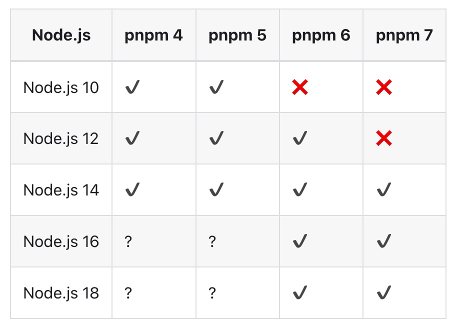
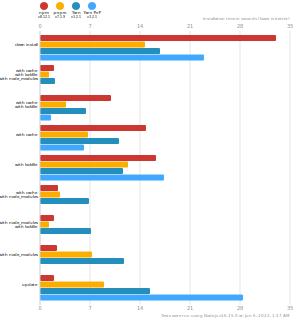

# pnpm

> 快速的，节省磁盘空间的包管理工具

## 简介

pnpm 是一个快速的、节省磁盘空间的包管理工具。pnpm 使用内容寻址的文件系统来存储磁盘上的所有模块文件

## 安装

+ 使用 npm

  ```
  npm install -g pnpm
  ```

+ 使用 Homebrew

  如果你已经安装了 Homebrew 软件包管理器，则可以使用如下命令赖安装 pnpm：

  ```
  brew install pnpm
  ```

## 兼容性

下图列出了以往的 pnpm 版本和对应支持的 Node.js 版本



## 命令

以下是与 npm 等价命令的对照表：

| npm 命令       | pnpm 等价命令   |
| -------------- | --------------- |
| npm install    | pnpm install    |
| npm i  <pkg>   | pnpm add  <pkg> |
| npm run  <cmd> | pnpm <cmd>      |

## 特点

+ 速度快

  pnpm 相较于 npm/yarn 两个常用的包管理工具性能得到大幅提升，下图为官方提供的基准测试数据

  

  

  

+ 节省磁盘空间

  pnpm 内部使用`内容寻址`的文件系统来存储磁盘上所有的文件

  >1、使用 `npm/yarn` 时，如果你有 100 个项目，并且所有项目都有一个相同的依赖包，那么， 你在硬盘上就需要保存 100 份该相同依赖包的副本，但是`pnpm`会只在一个地方写入这部分代码，后面使用会直接使用`hard link`，不会占用额外的磁盘空间
  >
  >2、当这个依赖包需要更新到新版本时，并且新版本中只有一个文件有修改。`pnpm` 并不会重新写入101个文件，而是保留原来的 100 个文件的 `hard link`，仅仅写入那`一个新增的文件`到存储中

## 依赖管理

pnpm 采用`Hard link` （硬链接）和 `Symbolic Link`（符号链接）来创建依赖关系的嵌套结构

假设安装`foo@1.0.0`依赖于`bar@1.0.0`,  pnmp 会将这两个包硬链接到`node_modules` ：

```
node_modules
└── .pnpm
    ├── bar@1.0.0
    │   └── node_modules
    │       └── bar -> <store>/bar
    │           ├── index.js
    │           └── package.json
    └── foo@1.0.0
        └── node_modules
            └── foo -> <store>/foo
                ├── index.js
                └── package.json                
```

一旦所有的包都被硬链接到`node_modules` ，符号链接就会被用来构建嵌套依赖关系图

这时，两个包都被硬链接到`node_modules` 文件夹内的 ( `foo@1.0.0/node_modules/foo`)子文件夹中。这是为了：

 1. **允许包导入自身。**`foo` 可以`require('foo/package.json')`或`import * as package from "foo/package.json"`

 2. **避免循环符号链接。**包的依赖关系被放置在依赖包所在文件夹中。对于 Node.js 来说，依赖项在包的`node_modules`中还是在某个父级目录的`node-modules`中是没有区别的

    

下一步，安装符号链接依赖。`bar` 被符号链接到`foo@1.0.0/node_modules`文件夹：

```
node_modules
└── .pnpm
    ├── bar@1.0.0
    │   └── node_modules
    │       └── bar -> <store>/bar
    └── foo@1.0.0
        └── node_modules
            ├── foo -> <store>/foo
            └── bar -> ../../bar@1.0.0/node_modules/bar
```

接下来，处理直接依赖关系。`foo` 将被符号链接到`node_modules`根文件夹，因为`foo`是项目的依赖项：

```
node_modules
├── foo -> ./.pnpm/foo@1.0.0/node_modules/foo
└── .pnpm
    ├── bar@1.0.0
    │   └── node_modules
    │       └── bar -> <store>/bar
    └── foo@1.0.0
        └── node_modules
            ├── foo -> <store>/foo
            └── bar -> ../../bar@1.0.0/node_modules/bar
```

如果这时，添加`qar@2.0.0`为`bar`和`foo`的依赖项：

```
node_modules
├── foo -> ./.pnpm/foo@1.0.0/node_modules/foo
└── .pnpm
    ├── bar@1.0.0
    │   └── node_modules
    │       ├── bar -> <store>/bar
    │       └── qar -> ../../qar@2.0.0/node_modules/qar
    ├── foo@1.0.0
    │   └── node_modules
    │       ├── foo -> <store>/foo
    │       ├── bar -> ../../bar@1.0.0/node_modules/bar
    │       └── qar -> ../../qar@2.0.0/node_modules/qar
    └── qar@2.0.0
        └── node_modules
            └── qar -> <store>/qar
```

所以，无论依赖项的数量和依赖关系图的深度如何变化，`node_modules`的结构都会保持这种布局

node_modules 根目录中的包只是一个符号链接。`require('foo')` 将执行 `node_modules/.pnpm/foo@1.0.0/node_modules/foo/indexjs` 中的文件（这里是硬链接），而不是 `node_modules/foo/index.js` 中的文件。

## 严格性

一个包只能访问其 package.json 中指定的依赖关系


